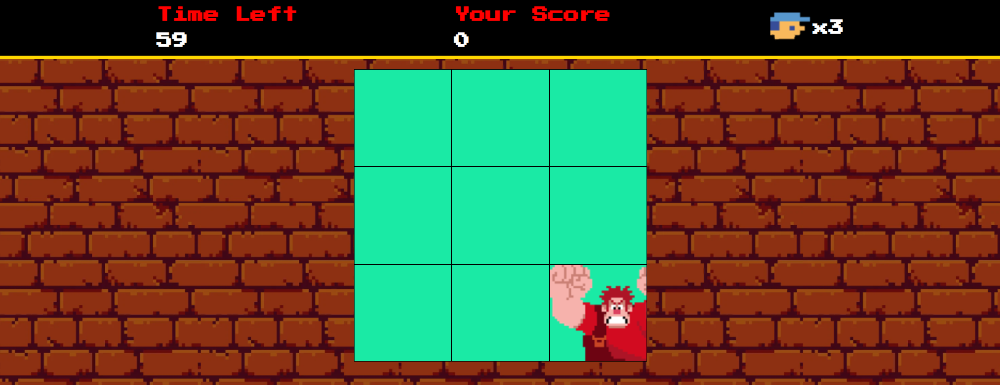

# Desafio 02: Criando um jogo baseado no filme Detona Ralph utilizando HTML, CSS e Javascript

Bem vindo(a) ao resultado do meu segundo desafio na Trilha de CSS da DIO! Onde construí meu primeiro jogo com HTML, CSS e Javascript, explorando eventos Javascript e manipulando áudios no browser.

[Clique aqui]() para acessar o resultado final do jogo criado por mim a partir do desafio da DIO!

